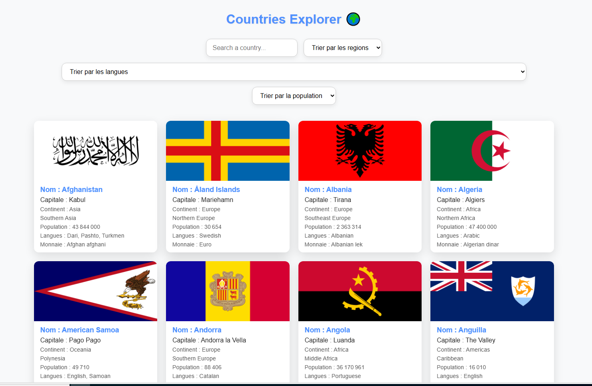

# 🌍 Countries Explorer

Countries Explorer est un projet web interactif qui vous permet de **découvrir et explorer les pays du monde** avec une interface simple et dynamique.  

Le projet utilise les données de l’API [REST Countries](https://restcountries.com/) pour afficher des informations détaillées sur chaque pays : nom, capitale, continent, sous-région, population, langues parlées, et monnaie.  

---

## ✨ Fonctionnalités principales

- **Recherche instantanée** : recherchez un pays par son nom ou sa région.  
- **Filtres intelligents** : filtrez les pays par **région**, **langue**, ou **population**.  
- **Interface interactive** : cliquez sur un pays pour afficher un **détail complet dans un overlay**.  
- **Tri automatique** : les pays sont affichés par ordre alphabétique pour une navigation plus intuitive.  
- **Responsive et moderne** : adapté aux écrans de bureau et tablettes avec animations fluides pour une meilleure expérience utilisateur.  

---

## 📸 Aperçu de l’interface



---

## ⚡ Technologies utilisées

- HTML5, CSS3, et JavaScript pur  
- API REST Countries pour les données en temps réel  
- Flexbox et Grid pour un layout moderne et responsive  
- Animations CSS pour des interactions dynamiques

---

## 🚀 Comment utiliser

1. Clonez ce dépôt :  
```bash
git clone https://github.com/Calebdami/Projet_Countries_Explorer.git
